# People Payroll Applicaton

## A command Line Interface Application

___

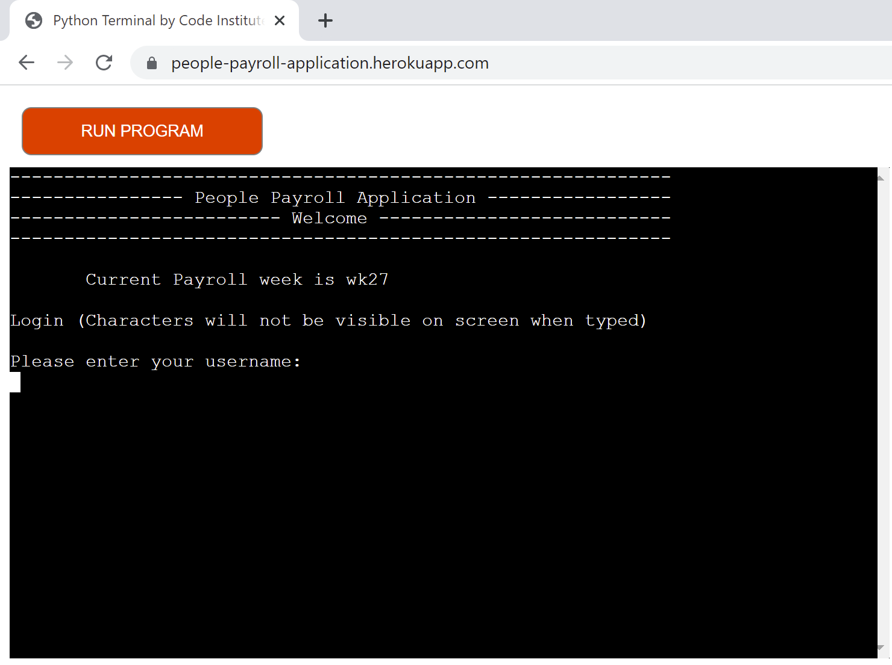

**People Payroll is a terminal based application providing a solution to common pain points experienced by many small business owners. The application enables employers to process employee hours, and simultaneously calculate their pay/liabilities efficiently, eliminating the risk of manual calculation errors, and resulting in increased productivity.**

### View my deployed site. <a href="https://people-payroll-application.herokuapp.com/"> People Payroll Applicaiton </a>

[Here](https://docs.google.com/spreadsheets/d/1Mh0WaeqPiZRDhHZpLVrVSoBcV8L4cPMKQXs2a-Z90Uo/edit?usp=sharing) is the link to the Google Spreadsheet, to see the updates made.

***
## Table of Contents 

1. [User Experience (UX)](#ux) 
    i.  [Strategy](#strategy) 
    ii. [Scope](#scope) 
    iii. [Structure](#Structure) 
    iv. [Skeleton](#skeleton) 
    v. [Surface](#surface) 
      
2. [Features](#features) 
    i. [Current Features](#features-current) 
    ii. [Features to implement](#features-toimplement) 

3. [Testing](#testing)

    * [User Stories/feature Testing](#user-stories-testing)
    * [Known issues during testing](#known-issues)
    * [Validation testing  ](#validation-testing)  #correct
    * [Bugs left](#unfixed-bugs)
4. [Deployment](#deployment)
5. [Technologies Used](#technology-used)
6. [Credits](#credits)
7. [Acknowledgements](#acknowledgements)

---
# 1. User Experience (UX)  
 
## Project Goals 
___

Project Goals for intended use are:

Create a payroll application: 

- to process employee hours quickly and efficiently by calculating their pay/liabilities effectively, resulting in increased accuracy and productivity.
- that enables users to navigate with ease.
- that is intuitive to all users.

Personal Goal:
- Having spent many years working in the hospitality industry and managing a food production site, I have experienced much pain whilst implementing the payroll process, such as the amount of time it can take and the risk of creating manual errors/miscalculations and their repercussions. I wish to create a painless process and excellent user experience for any user, drawing upon my familiarity of the process to provide meaningful solutions and implement an algorithm.

## User Goals 

- Payroll staff should find the system intuitive to navigate and easy to use.

- The system should give feedback to let the user know where the program is at every stage and be able to submit the payroll via Google Sheets, ready for the ‘accountant’ to make payments.

- The target audience for this terminal based application are employers who want to process their employees payroll and submit for deployment via Google Sheet.

---

# i. Strategy 

## User Stories: 

### Site User stories:
1.	As a user, I  want a secure application/login to protect against unauthorised access 
2.	As a user, I want a terminal based application to import/export data via google sheets
3.	As a user, I want to easily navigate through the different functions to view and process payroll
4.	As a user, I want to process employees hours and receive feedback if I duplicate data inputted already for an employee in that particular week
5.	As a user, I want an application that calculates Basic pay, Holiday pay, Employee NI contributions, Pension Contributions, Net pay, Employee NI contributions, Pension Contributions
6. As a user, I want full visibility of an employee’s payment summary before submission to payroll (send to google sheets spreadsheet)
7. As a user, I want full visibility of all employees payment summaries for any week at any time
8. As a user, I want full visibility of an employee’s payment summary for the previous week with the ability to modify inputted hours for the previous week if required
9. As a user, I want full visibility of the business’s payment summary, consolidated by week 
10. As a user I want to be able to locate an employee and their details quickly/efficiently
11. As a user with no formal finance training/qualifications I need simple and easy to understand terminology
12. As a user I need to be able to trust the application to calculate payments accurately
13. As a user I need quick painless process, in order to free up more time to be productive in other areas of my role.

### Site Owner Goals 

14. I want a terminal based application containing validated Python code which allows the user to navigate the system intuitively without returning errors
	
### [Contents table ](#home)
---
# ii. Scope 

## Strategy Trade-offs
I have rated the features on a scale of 1 to 5 in terms of importance (how important is it for the project now) and viability (how realistic is that we can implement a solution)

To achieve the strategy goals, the following features highlighted in dark/light green will be implemented to create a minimal viable  product due to timescale and technical ability. The additional features in red will be added at a further stage

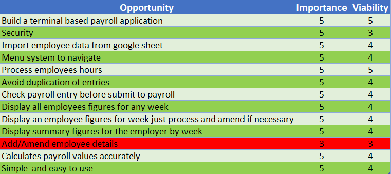 

### [Contents table ](#home)
---
# iii. Structure  

The payroll system relies on user input from the menu system.  The user will navigate to the different options via the main menu system.

An option to return to the main menu is easily/consistently visible on each page.

It is important that the application is easy to navigate and provides feedback to the user to inform them at what stage/status of the process they are at.

### **1.	Welcome and security screen**

    
Click here to view the home screen

 
This welcomes the user to the application, to access the application the user needs to enter a (non-visible) password. The main menu will then be displayed

____

### **2.	Main menu**

    
Click here to view the main menu

 

People Payroll Application 

Main menu 
1 Display payroll  
2 Process / Amend payroll 
3 Add / Amend employee details 
4 Close application 

___
### **3. Display payroll menu **

    
Click here to view the display payroll menu

 

### **User inputs** numeral 1, the first option 1 in main menu. The next step is the ‘Display Payroll’ menu 

People Payroll Application 

Display payroll menu 
1 Overall employees’ pay for week selected 
2 Employee pay for week selected 
3 Employers summary by week 
4 Main menu 

### **User inputs** numeral 1, the first option in the ‘Display Payroll’ menu. 

The next step is ‘Enter Payroll Week (1-52) :’ 
User enters required fiscal/calendar week by inputting the relevant numeral, then all employees payroll is displayed to the terminal for relevant week

### **User inputs** numeral 2, the second option in the ‘Display Payroll’ menu.

The next step is ‘Enter Payroll Week (1-52) :’
User enters required fiscal/calendar week by inputting the relevant numeral

The next step is ‘Enter Employee Number e.g. 100014 :’ 
User enters required employee number, the terminal then displays the employees pay summary for relevant week

### **User inputs** numeral 3, the third option in the ‘Employer’s summary for the week’

Immediately the employers payment summary is displayed by week

### **User inputs** numeral 4, the fourth option in the ‘Main menu’

The main menu is displayed
___
### **4. Process / amend payroll menu **

    
Click here to view the process / amend payroll menu

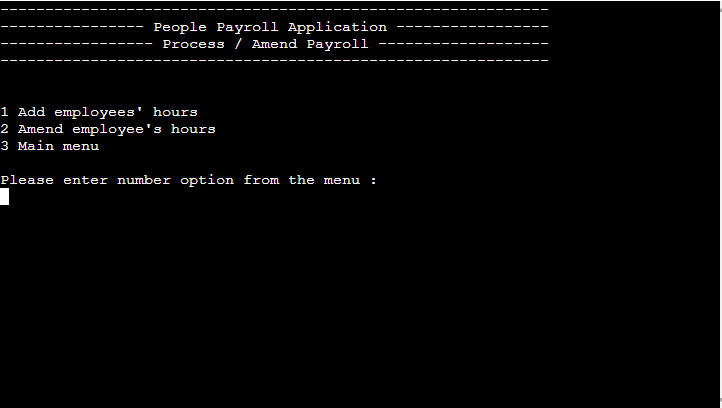

 

### **User inputs** numeral 2, the second option in main menu. The next step is the ‘Process / amend payroll’ menu 

People Payroll Application 

Process / amend payroll 
1 Add Employees hours 
2 Amend employees hours 
3 Main menu 

### **User inputs** numeral 1, the first option in the ‘Process / amend payroll’ menu.

The next step is ‘Enter Employee Number e.g. 100014 :’ 
User enters required employee number in numerals,

The next step is ‘Enter number of hours worked :’
User enters required hours in numerals,

The amounts are displayed to the screen
The next step is “if the amounts are correct”
User enters required Y,

The values are added to google sheet employee payroll sheet 

### **User inputs** numeral 2, the second option in the ‘Process / amend payroll’ menu.

The next step is ‘Enter Employee Number e.g. 100014 :’ 
User enters required employee number in numerals,

The next step is ‘Enter number of hours worked :’
User enters required hours in numerals,

The amounts are displayed to the screen
The next step is “if the amounts are correct”
User enters required Y,

The values are added to google sheet employee payroll sheet 

### **User inputs** numeral 3, the third option in the ‘Process / amend payroll’ menu

The main menu is displayed

### **5. Add / Amend employee details **

    
Click here to view the Add / Amend employee details menu - Future Feature

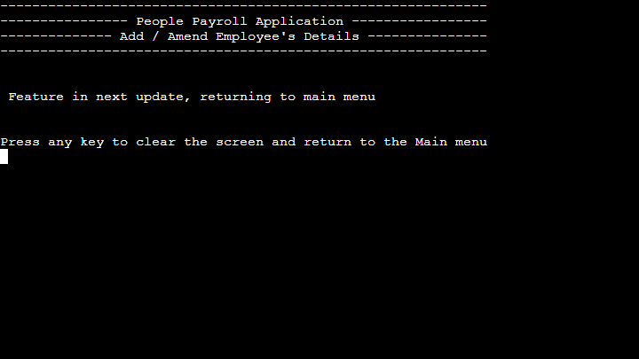

 

User inputs numeral 3, the third option in main menu. The next step is the Feature in next update, returning to main menu is displayed.

### **6. Close application **

User inputs numeral 4, the forth option in main menu. The application closes. 

### [Contents table ](#home)

---
# iv. Skelton  

## Flowcharts

I used <a href=" https://www.lucidchart.com/">Lucid Chart</a> to create flowcharts for my project in order to plan out flow of the application

    
Click here to view flowchart - Security and menu  

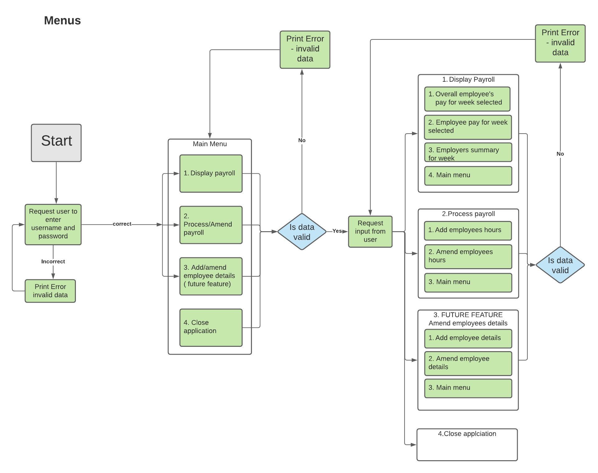

 

    
Click here to view flowchart - display payroll option 1 

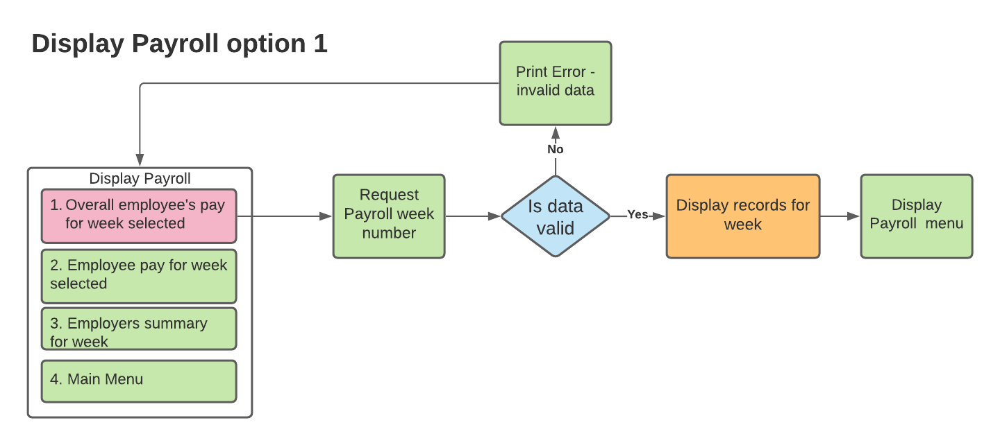

 

    
Click here to view flowchart - display payroll option 2 

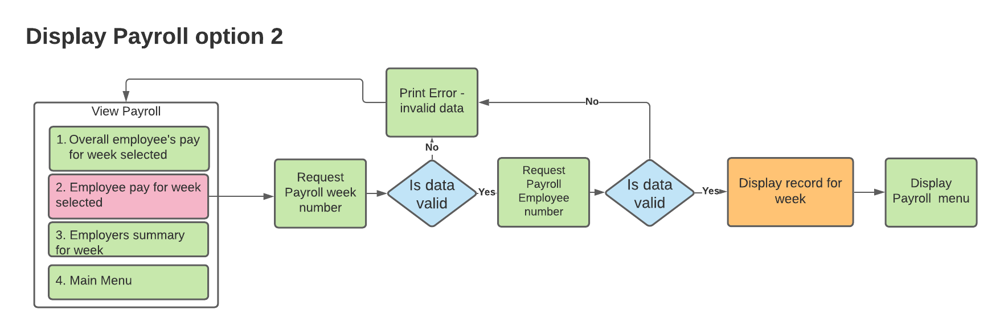

 

    
Click here to view flowchart - display payroll option 3 

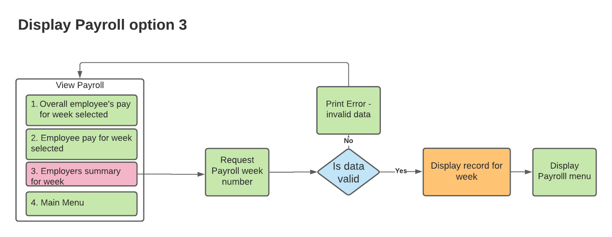

 

    
Click here to view flowchart - Process payroll add / amend 

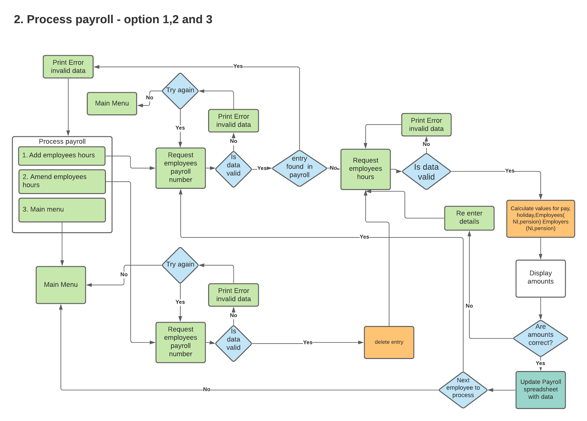

 

    
Click here to view flowchart - Data model, variables and rules 

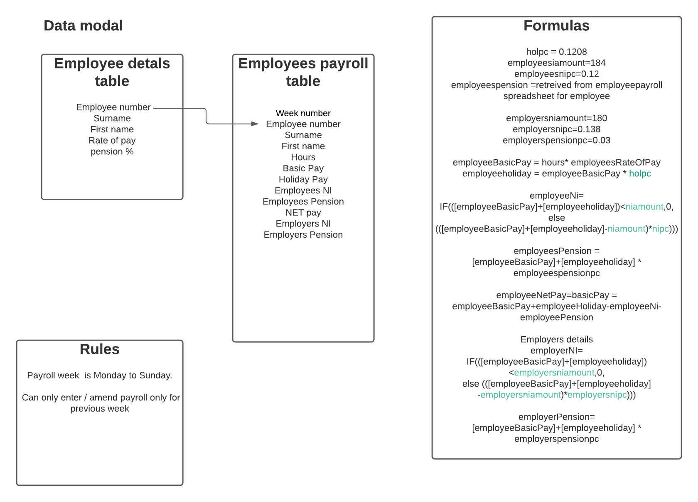

 

### [Contents table ](#home)
___

# iv. Surface  

## Visual Design

As this is a terminal based application the styling is very limited so I have focused/prioritised optimizing functionality, especially in providing the user feedback required at the correct points of the application, coupled with ease of navigation.

---
# 2. Features  

## i. Current Features (short term objectives): 
___

### **Feature 1: Welcome Message and security**

    
Click here to view the home screen

 
The user is welcomed to the payroll application and prompted to enter a username and password (no password characters are visible) 
If the user enters:  
- the correct password, the main menu is displayed 
- an incorrect password, the user will be prompted to try again 

**User stories covered:** 
*1.	As a user, I  want a secure application/login to protect against unauthorised access*
___
### **Feature 2: Menu system**
The menu system consists of all the options required to facilitate all stages of the payroll process as follows:

___

    
Click here to view the main menu

 
People Payroll Application 

**Main menu** 
1 Display payroll 
2 Process / Amend payroll 
3 Add / Amend employee details 
4 Close Application 

___
*Option 1* from the main menu typed , display the payroll menu

    
Click here to view the display payroll menu

 
People Payroll Application 

**Display payroll menu** 
1 Overall employees’ pay for week selected 
2 Employee pay for week selected 
3 Employers summary by week 
4 Main menu 
___
*Option 2* from the main menu typed , display the process /amend payroll menu

    
Click here to view the process / amend payroll menu

 

People Payroll Application 

**Process / amend payroll menu** 
1 Add Employees hours 
2 Amend employees hours 
3 Main menu 
___
If an incorrect number option is typed during any of the menu selections, the user will receive feedback: ‘Invalid data, please try again.’

**User stories covered:** 
*3.	As a user, I want to easily navigate through the different functions to view and process payroll 
11. As a user with no formal finance training/qualifications I need simple and easy to understand terminology 
13. As a user I need quick painless process, in order to free up more time to be productive in other areas of my role. 
14. I want a terminal based application containing validated Python code which allows the user to navigate the system intuitively without returning errors *
	
___
### **Feature 3: Display payroll**
From the main menu, the user will be prompted to select an option by typing the relevant numeral.

*Option 1* from the main menu typed , the payroll menu will be displayed
People Payroll Application 
___
**Display payroll menu** 
1 Overall employees’ pay for week selected 
2 Employee pay for week selected 
3 Employers summary by week 
4 Main menu 
___

The user will be prompted to select an option by typing the relevant numeral

*Option 1* typed from the display payroll menu ( 1 Overall employees’ pay for week selected)

User will be prompted to enter the payroll week which must be before the current payroll week. 

If the user inputs invalid data, they will receive feedback: 
‘Invalid week number, please try again’

After validation, the  API request is made and displays all employees payroll information for the week

‘Press any key to clear the screen and return to the display payroll menu’ message will be displayed to give the user time to view the information

then the display payroll menu is displayed

1. Overall employees’ pay for week selected report

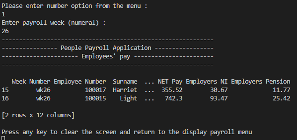

 
___

*Option 2* selected from the display payroll menu - 2 Employee pay for week selected  

User will be prompted to enter the payroll week which must be before the current payroll week. After validation, the user will be then prompted to enter the employee number  
If the user has entered incorrectly, an error message will be displayed ‘Invalid employee number, please try again.’ 
Then the user will be prompted ‘Do you want to try again? type y or n :’ 
If no they will be taken back to the main menu

There is further validation to check if the employee number has a record in the employee detail sheet.  

If the employee number has been found the employees payroll sheet for the week, the data is displayed

If there is no record, a error message will be displayed
“No payroll record found for employee number: xx in xx”

‘Press any key to clear the screen and return to the display payroll menu’ message will be displayed to give the user time to view the information

then the display payroll menu is displayed

2. Employee pay for week selected report

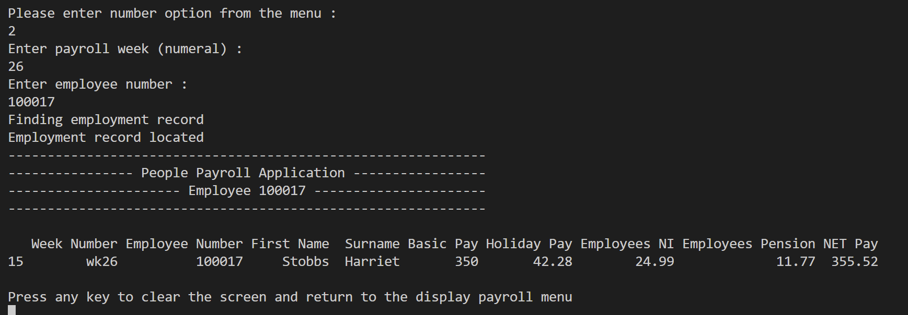

 
___
*Option 3* selected from the display payroll menu - 3. Employers summary for week 

The data is summarised for each heading and grouped by week and displayed to the terminal

‘Press any key to clear the screen and return to the display payroll menu’ message will be displayed to give the user time to view the information

then the display payroll menu is displayed

3. Employers summary by week report

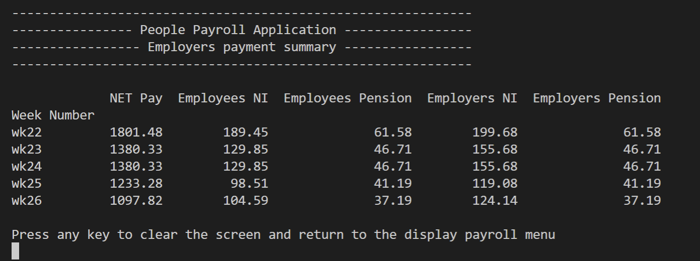

 

___

*Option 4* selected from the display payroll menu -  Main menu 

The main menu is displayed

4. Main menu

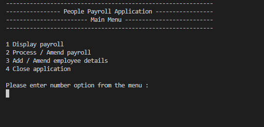

 

___

**User stories covered:** 
*3. As a user, I want to easily navigate through to the different functions to view and process payroll 
7. As a user, I want full visibility of all employees payment summaries for any week at any time 
8. As a user, I want full visibility of an employee’s payment summary for the previous week with the ability to modify inputted hours for the previous week if required 
9. As a user, I want full visibility of the business’s payment summary, consolidated by week  
11. As a user with no formal finance training/qualifications I need simple and easy to understand terminology 
12. As a user I need to be able to trust the application to calculate payments accurately 
13. As a user I need a quick painless process, in order to free up more time to be productive in other areas of my role.* 

**Owners stories covered:** 
14. I want a terminal based application containing validated Python code which allows the user to navigate the system intuitively without returning errors 

___
### **Feature 4: Process /Amend payroll**
___
From the main menu, the user will be prompted to select an option by typing in the relevant numeral

Option 2 from the main menu typed, the process / amend payroll menu will be displayed
___
People Payroll Application 

**Process / amend payroll** 
1 Add Employees hours 
2 Amend employees hours 
3 Main menu 
___
The user will be prompted to select an option by typing in the relevant numeral

*Option 1* typed from the process / amend payroll menu (1. Add Employee’s hours) 
The user will be then prompted to enter the employee number, validation will check if the employee number is in the google sheets employee detail sheet.  

There is additional validation to ensure there is no employee record already entered into google sheets employee payroll sheet, to avoid duplicates.

If there is already an existing employee record in the payroll sheet, the application will provide feedback to the user 

“Employees hours already entered in wkxx, please go to option 2 to amend”

‘Press any key to clear the screen and return to the display payroll menu’ message will be displayed to give the user time to view the information

Providing there is no record already entered, 
‘No entry found in payroll’ message will be displayed

The user will be then prompted to enter the hours worked, validation will check if the value is a float.  If incorrect then ‘Invalid data, please try again.’ Is displayed and the user is prompted to enter the hours worked again

The system will now calculate all the values for basic pay, holiday pay, NI contribution, pension contribution, net pay, employers NI contribution and employers contribution and display these values.

The user will be prompted ‘Are the amounts correct?’. If the values are incorrect , the user type ‘n’ a message “re enter details’ is displayed and the user is prompted to ‘enter the hours worked’

If the values are correct, a message will be displayed “Ready to upload into payroll spreadsheet" then the information uploads the values to the google sheets. When successfully ‘employeepayroll worksheet updated successfully’ is displayed

The user will then prompted if they would like to process another employees hours which they can add another employees hours or go back to the main menu

    
Click here to view add employees' hours

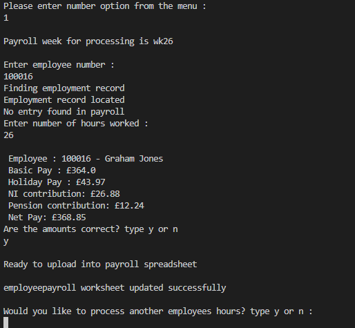

 

___
*Option 2* typed from the  process / amend payroll menu (2 Amend employees hours) 
The user will be prompted to enter the employee number, validation will check if the employee number is in the google sheets employee detail sheet.  

There is additional validation to ensure there is an employee record already entered into google sheets employee payroll sheet to ensure we can amend the result
If no record is found ‘No payroll record found for 100017 in week wk26, returning to main menu.’ Will be displayed

‘Press any key to clear the screen and return to the display payroll menu’ message will be displayed to give the user time to view the information and then the process /amend payroll menu will be displayed

If an record is found, ‘Employment record located’ message will be displayed . This record will be deleted and the user will be prompted to enter the employees hours again which will follow the add employees detail features above

Click here to view amend employees' hours

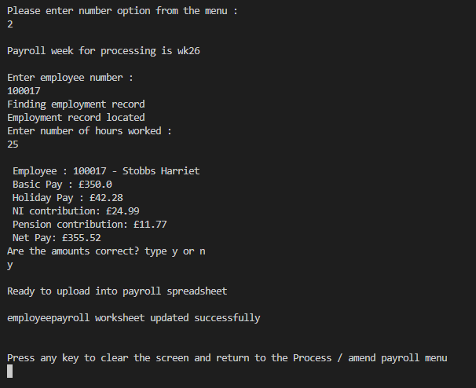

 

Click here to view amend employees' hours- Google sheets

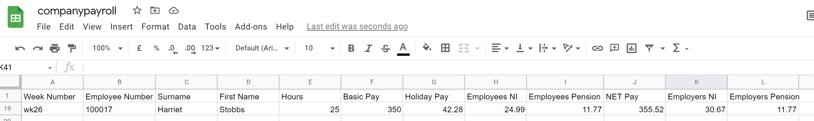

 

___

Option 3 typed from the  process / amend payroll menu  ( 3 Main menu)

Display the main menu

Click here view display the main menu

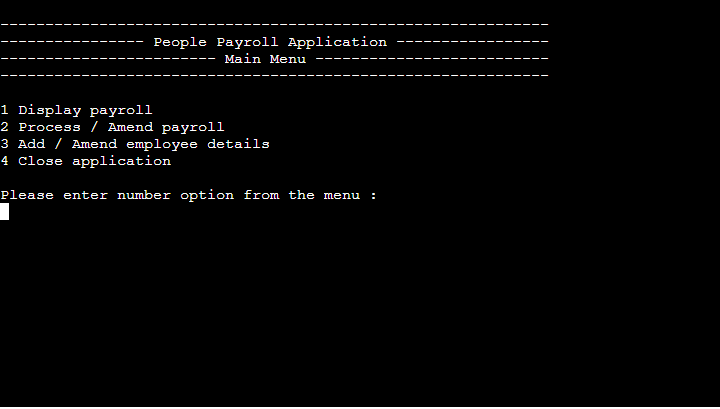

 
**User stories covered:** 
*2.	As a user, I want a terminal based application to import/export data via google sheets 
3.	As a user, I want to easily navigate through the different functions to view and process payroll 
4.	As a user, I want to process employees hours and receive feedback if I duplicate data inputted already for an employee in that particular week 
5.	As a user, I want an application that calculates Basic pay, Holiday pay, Employee NI contributions, Pension Contributions, Net pay, Employee NI contributions, Pension Contributions 
6. As a user, I want full visibility of an employee’s payment summary before submission to payroll (send to google sheets spreadsheet) 
11. As a user with no formal finance training/qualifications I need simple and easy to understand terminology 
12. As a user I need to be able to trust the application to calculate payments accurately 
13. As a user I need quick painless process, in order to free up more time to be productive in other areas of my role.* 

**Owners stories covered:** 
*14. I want a terminal based application containing validated Python code which allows the user to navigate the system intuitively without returning errors*
	
___	
### **Feature 5:  Add / Amend employee details**
___
This is a future feature

**User stories covered:** 
*10. As a user I want to be able to locate an employee and their details quickly/efficiently*

**Owners stories covered:** 
*14. I want a terminal based application containing validated Python code which allows the user to navigate the system intuitively without returning errors*

---
## Features remaining to implement (long term objectives): 

- Add / Amend employee details
- Statutory sick pay, maternity/Paternity leave
- Bonuses
- Payroll for salary staff
- Admin password to display as astericks
- Allow different users with different access
- Change password

# Data structure to do

### [Contents table ](#home)

---
# Testing  

User stories are tested with the features that cover them. All user stories passed the tests.

# Click on link to testing of user stories
check if link works
[Link to testing ](https://github.com/ccarabine/payroll/blob/main/docs/testing.md)
---
## User stories testing  

---
## Known issues during testing 

During development the following issues were identified and corrected

 - **Issue:** 
 
 *When selected display payroll option 2, to display employee paym then the user entered an employee number that wasn't located, an index error occurred*

-	**Corrective Action:** 

*Added an except indexerror and error message "No record found"*
___
- **Issue:** 

*User selected option 1, option1 for display For the display "Overall employees' pay for week selected".  The user then input a week with no data, this would display an error message as it only allows the previous week to be entered*

- **Corrective Action:** 

*Put in a “status” for the week with “normal” and “any week” so for this function the status would be “any week”*

**I have further removed this code so they display any week**
___
- **Issue:** 

*Add employees hours, it would only allow the user to enter the  current week payroll when the payroll needs to be the previous week*

- **Corrective Action:** 

*Add in function previous_week = current week -1*
___
- **Issue:** 

*On main menu screen, the user could type in “4 “*

- **Corrective Action:** 

*change maxvalue to 3*
___
- **Issue:** 

*The result of the employees pension contribution was incorrect as it was calculating only the basic pay  * pension % when it needs to be based on basic plus holiday pay *pension %*

- **Corrective Action:** 

*changed from employee basic pay to employee_basic_hol ( basic plus holiday)*
___
- **Issue:** 

*To display employees payroll record, the function would used getallvalues.  There was multiple employees with e.g."25" hours and we wanted to display all records for week "25", the data would display with the employees hours matching 25 as well*

**Corrective Action:** 

*Get payroll week added concatenate so week is "wk34" rather than just 34 so now we can getallvalues "wk34"*
___
- **Issue:** 

*User entered a letter when entering the payroll week, an error would occur*

- **Corrective Action:** 

*added an if, else statement to handle, with error message*
___

- **Issue:**

*The user entered a payroll week that wasn’t in the payroll spreadsheet a keyerror occured*

- **Corrective Action:** 

*added except keyError  and error message*
___

- **Issue:** 

*Display Employee payrole for week, the data frame is empty then it would display an empty dataframe*

- **Corrective Action:** 

*created an if statement “if display_employee_data.empty then display error message, if it has data then display data*
___

- **Issue:** 

*When selecting option 3, 3 Employers summary for week this message is displayed*

*run.py:510: FutureWarning: Indexing with multiple keys (implicitly converted to a tuple of keys) will be deprecated, use a list instead.*

- **Corrective action**

[Warning indexing with multiple keys](https://stackoverflow.com/questions/60999753/pandas-future-warning-indexing-with-multiple-keys)

Add brackets around DF selection
___

- **Issue:** 

*for add / amend employees hours, user had to enter the week ( which could only be the previous week)*

- **Corrective action:**

*No user input required just added code to put the previous week into the variable payroll_week*

___

- **Issue:** 

*Display records in display menu options 1,2 and 3 would only show a limtied amount of fields due to the constraints of the deployment terminal is set to 80 characters*

- **Corrective action:**

*Reduced the descriptions of 
- Employee NI & Employee Pension to EE NI & EE Pension 
- Emplorer NI & Emplorer Pension to Er NI & Er Pension
- Holiday pay to Hol pay

Reduced the number of fields in the reports*

### [Contents table ](#home)

---
## PEP8 Online Validation Service:
All Python files passed the [PEP8](http://pep8online.com/) and [Pylint](https://www.pylint.org/) tests with 0 errors.

Click [here](https://github.com/johnvenkiah/CI_PP3_John_Venkiah/blob/main/docs/validation/validation.md) to view them.

 

---
##  Unfixed Bugs  

No Bugs left to fix

### [Contents table ](#home)
---
# Deployment  

## Github
___

This is the process i took to deploy my project to the hosting platform GitHub
1.	Open Github page up in browser
2.	Log in using your username and password
3.	Select "ccarabine/payroll" from repositories displayed on left-hand side of screen
4.	Click "settings” displayed in the navigation toolbar menu
5.	Click “Pages” on the left hand side navigation menu
6.	Select "Master Branch" in the dropdown under the Source heading
7.	Finally, click “save”

 The live link can be found here 
 <a href="https://ccarabine.github.io/payroll/">People Payroll Application </a>

___
## Heroku
___
This application has been deployed from Github using Heroku. Here's how:

1. Create an account at [heroku.com](https://.heroku.com/)
2. Create a new app, add app name and your region
3. Click on create app
4. Go to "Settings"
5. Under Config Vars, add your sensitive data 
creds.json for example type `CREDS` in the
key field and the code in the value field. 
You must then create another called `PORT`. Set this to `8000`
6. For this project, I set buildpacks to `Python` and `NodeJS` in that order. Ensure python is on ontop
7. Go to "Deploy" and at "Deployment method", click on "Connect to Github"
8. Enter your repository name and click search, then connect
9. Choose the branch you want to buid your app from
10. If desired, click on "Enable Automatic Deploys", which keeps the app up to date with your Github repository
11. Click deploy branch
 <a href="https://people-payroll-application.herokuapp.com/">People Payroll Application </a>

### Constraints

The deployment terminal is set to 80 columns by 24 rows. That means that each line of text needs to be 80 characters or less otherwise it will be wrapped onto a second line.
___
## Google API
___
Here's how you can set up your own API:

1. Login or create a Google account and navigate to https://console.cloud.google.com/
2. Create a new Project by clicking on the New Project icon
3. Add Project name and details
4. Under API's and services, enable the relevant API for your project (in this case Google Drive and Sheets )
5. IF the API requires, create a credential (service account in this case) for your project
6. Download the credential and upload it to your workspace a a json-file
7. Under API's and services, enable the relevant API for your project (in this case Google Drive and Sheets)

---
# Technologies Used   
### Languages

- [Python 3](https://www.python.org/) - Was used solely to create this project.

I have also utilised the following applications, platforms  and libraries:

* [GitPod](https://www.gitpod.io/) :  I used GitPod as the IDE for this project and Git has been used for Version Control.

* [GitHub](https://www.github.com/) : GitHub has been used to create a repository to host the project and receive updated commits from GitPod.

* [Heroku](https://id.heroku.com) : Used to deploy the application.

* [Google Cloud Platform](https://console.cloud.google.com/home/dashboard?project=payroll-326612) : Google Cloud Platform has been used for APIs and credentials to be able to access Google Sheets with the relevant data.

- [Google Sheets](https://docs.google.com/spreadsheets/u/0/): Spreadsheet to store the data for employees details and employee payroll 

- [PEP8 Online Validation Service](http://pep8online.com/): The PEP8 Online Validation Service was used to validate the Python document for this project and to identify any issues with the code.

* [Lucid Chart](https://www.lucidchart.com/): Lucid Chart was used to create flowcharts

# to do Document the rationale as to why a particular library/libraries are necessary for the implementation of the project. NEED TO ADD ALL

#### Python Libraries

I have used these third party and Python libraries for this project for the following reasons:

- Getpass: to prompt the user for a password without showing the characters. 

- datetime: to get the current week of the year to calulate the payroll week

- time: to allow the application to use the sleep function which delays execution of the current thread for the given number of seconds.

- os: to allow the application to use the clear function,clearing the text from the terminal. The OS module in Python provides functions for interacting with the operating system and

#### Third Party Libraries

- google.oauth2.service_account: to allow the application access the account that the sheet is on with the credentials

- gspread: to allows to open the GoogleSheets. A Python API for Google Sheets.

- Pandas:  to allow importing data and displaying data

CHECK EVERYTHING IS IN HERE

[Contents table ](#home)
---
# Credits 

## Code
I used the following websites and videos for inspiration and code for my project

[yes/ no function](https://gist.github.com/garrettdreyfus/8153571)

[To check two lists for a value](https://learncodingfast.com/how-to-find-intersection-of-two-lists-in-python/)

[To get the week number using datetime](http://week-number.net/programming/week-number-in-python.html)

[Used for passwords](https://www.geeksforgeeks.org/getpass-and-getuser-in-python-password-without-echo/)

[Delay printing before next function](https://www.codegrepper.com/code-examples/python/how+to+pause+after+a+print+statement+in+python)

[clearing the terminal before next function](https://www.geeksforgeeks.org/clear-screen-python/)

[Use of gspread](https://docs.gspread.org/en/latest/user-guide.html)

[Using gspread-Finding and Updating Cells in google sheers](https://www.youtube.com/watch?v=yPQ2Gk33b1U)

[Using gspread to select a worksheet]( https://docs.gspread.org/en/latest/user-guide.html#selecting-a-worksheet)

[Using pandas](https://kanoki.org/2020/01/21/pandas-dataframe-filter-with-multiple-conditions/)

[Stack over flow – to group by and sum values using pandas](https://stackoverflow.com/questions/43745301/converting-column-from-dataframe-to-float-for-sum-usage-python-pandas)

[Group by and sum using pandas](https://stackoverflow.com/questions/39922986/pandas-group-by-and-sum)

[Summing in pandas](https://datagy.io/pandas-cumulative-sum/)

[National insurance calculation](https://www.gov.uk/national-insurance-rates-letters)

[Press any key](https://stackoverflow.com/questions/983354/how-to-make-a-script-wait-for-a-pressed-key)

---
# Acknowledgements 
A big thank you to my mentor Mo for his help and guidance throughout my third project

Thank you to to the following:

* My wife for her help and constructive feedback throughout the project. 
* The tutors for help and support.
